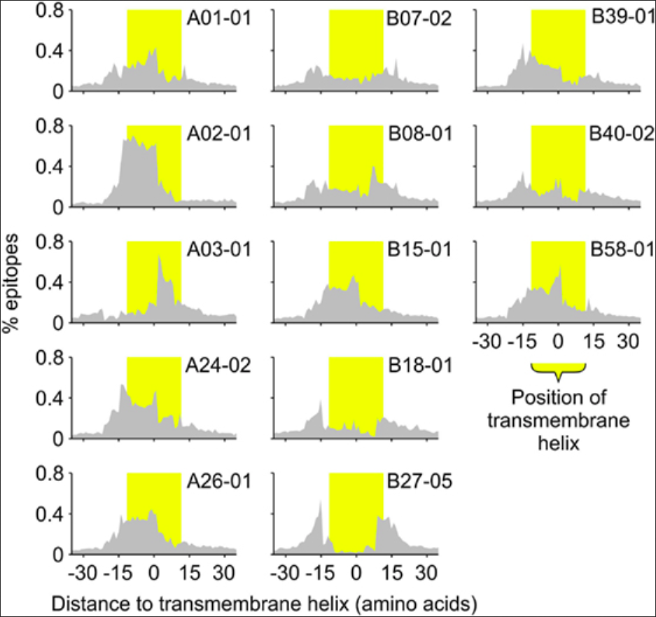
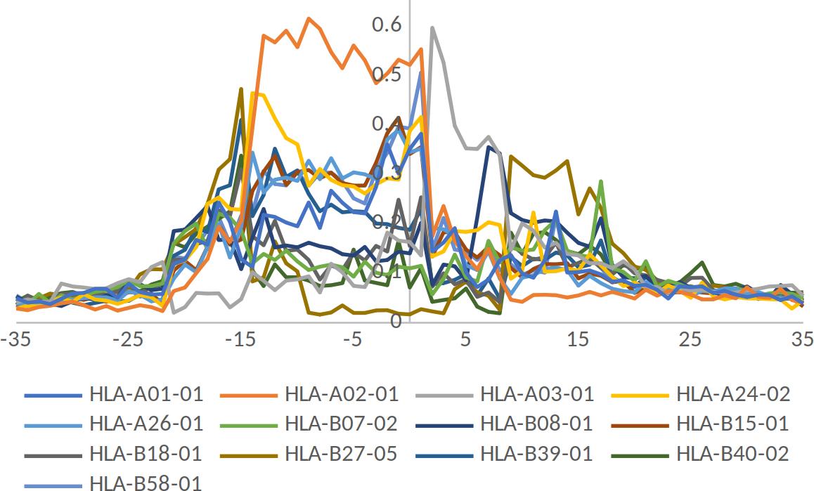
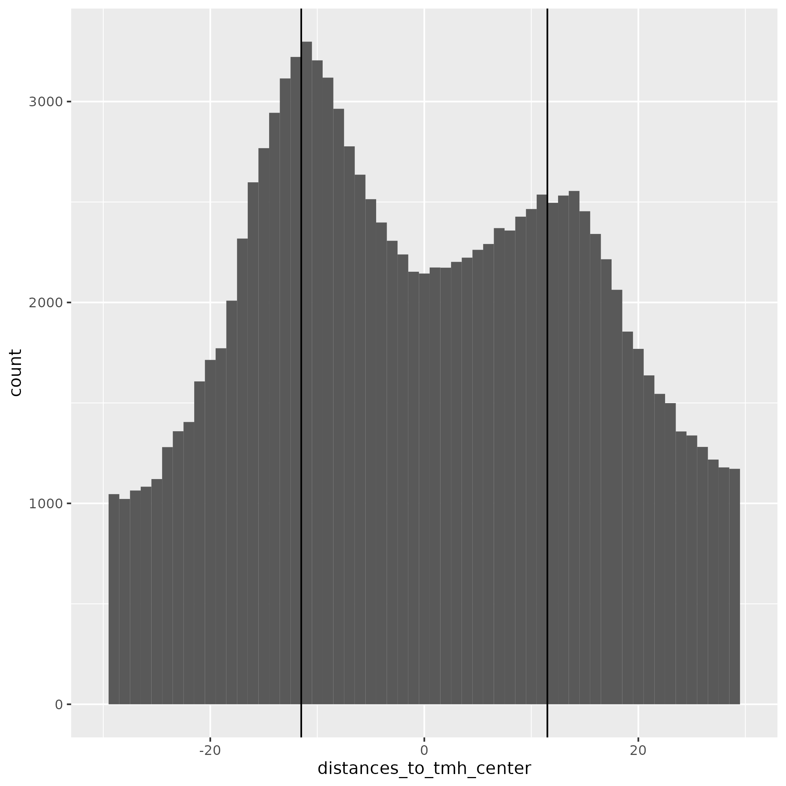
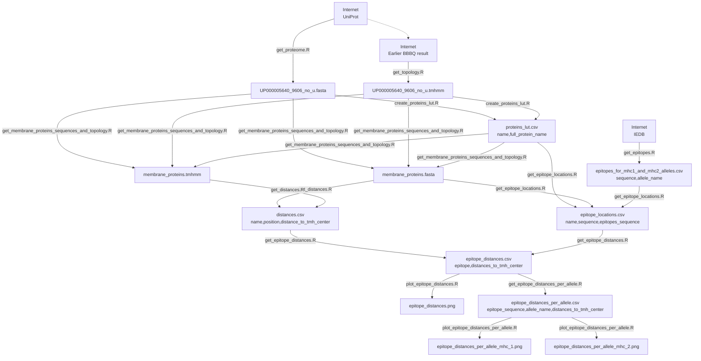

# bbbq_article_issue_265

## Goal

Recreate figure 3 from Bianchi et al., 2017,
for MHC-II and epitopes from IEDB.





## Result



## Run

```
make
```

Make sure you got about 18 GB of RAM for `get_epitopes.R`.

## Methods

I use [https://mermaid.live](https://mermaid.live) to be able to zoom in.



Note `name` instead of the more expressive `protein_name` is used, due
to the use of FASTA files: when parsing these, `name` is the default
column name.

## Bias for negative distances

Imagine this topology:

```
01010
```

This will be talled as such:

Position|Distance to TMH
--------|---------------
1       |-1
2       |0
3       |-1
4       |0
5       |1

Position 3 is right in between two TMHs, so the distance to the closest
TMH is undecided.

We expect this to be irrelevant in reality, as:

 * we expect TMHs to be separated by many amino acids
 * we plot from -30 to +30 amino acids

If you see a bias in negative distances, this cause be the cause.

## Ignore two epitopes in same protein

We assume an epitope to be present in a protein once.
Partial data shows that in (8 out of 3891 = ) 0.2%
of all cases this assumption is false.

For the epitopes that appear in a protein twice, 
only the location of the first is used in the calculations.

```
Total number proteins-epitope combination: 3899
1x epitope per protein: 3891
2x epitope per protein: 8
```

## Create graph from Makefile

From https://unix.stackexchange.com/a/576563:

```
cd GitHubs
git clone https://github.com/lindenb/makefile2graph
cd makefile2graph
make
```

```
make -Bnd |  ../makefile2graph/make2graph | dot -Tpng -o my_graph.png
```
