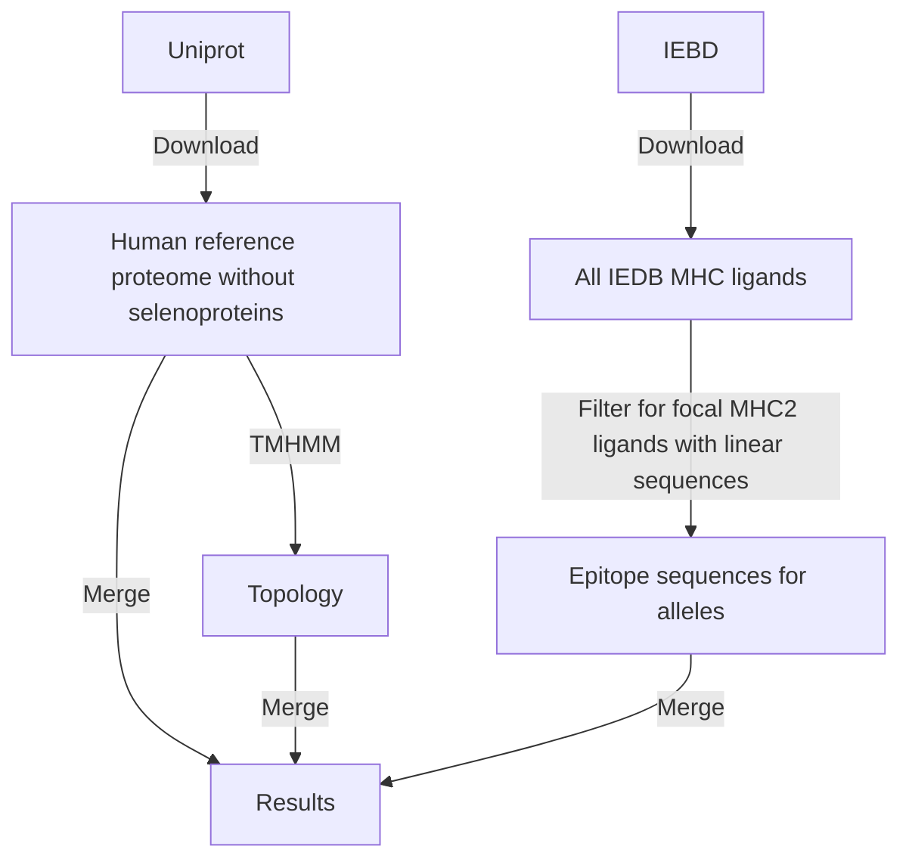
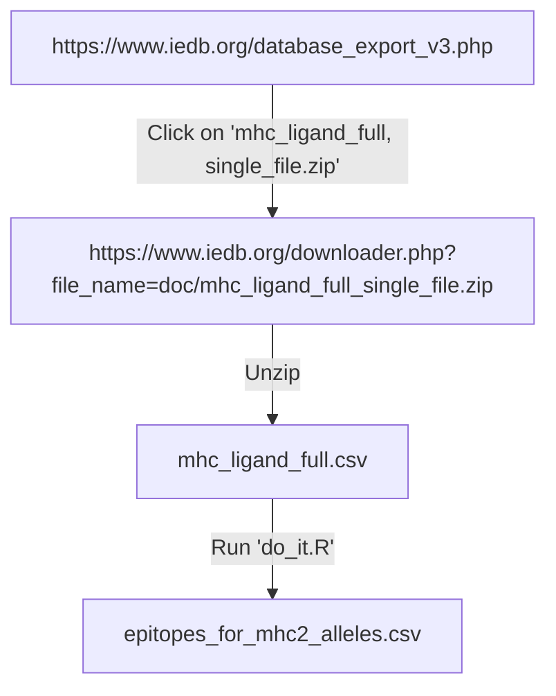

# bbbq_article_issue_265

## Goal

Recreate figure 3 from Bianchi et al., 2017,
for MHC-II and epitopes from IEDB.

 * [Methods](methods.md)
 * [Files](files.md)


 * Use `iedbr`
 * Use human TMH topology
 * Combine into plot

```
Epitopes from IEDB:

 AAAAAIFVI              
 MNILLQYVVKSFD           <----
 ALWMRLLPL              
 FLFAVGFYL              
 FLIVLSVAL              
 FLWSVFMLI              
 GIVEQCCTSI             
 GMAELMAGL               <----
 GSGDSENPGTARAWCQVAQKFTG
 GVLLKEFTVSGN         


                    GMAELMAGL
                                   MNILLQYVVKSFD

AAAAAAAAAAAAAAAAAAAAGMAELMAGLAAAAAAMNILLQYVVKSFDAAAAAAAAAAAAAAAAAAAAAAAAAAAAAAAAAAA
00000000000000000000000000011111111111100000000000000000000000000000000000000000000
```

## Methods



## Files



