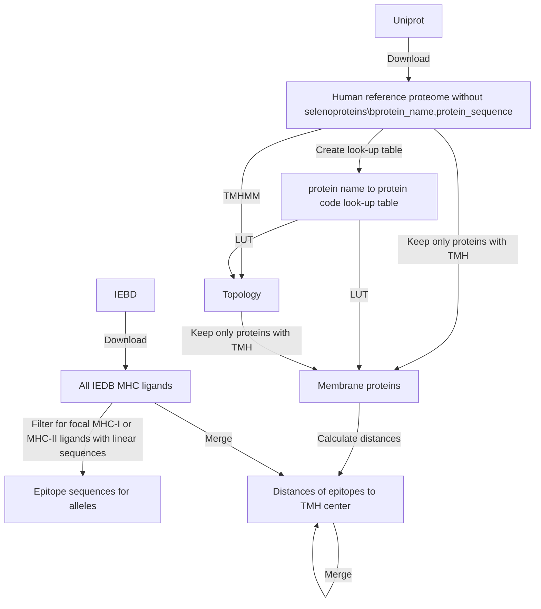
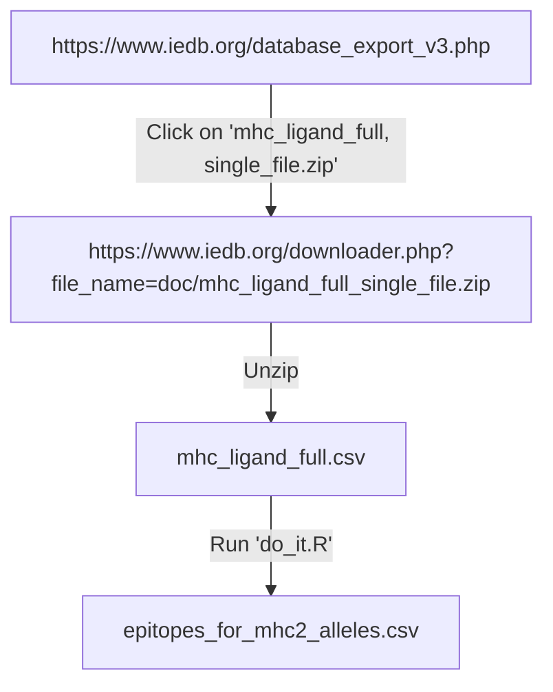

# bbbq_article_issue_265

## Goal

Recreate figure 3 from Bianchi et al., 2017,
for MHC-II and epitopes from IEDB.


## Run

```
make
```

Make sure you got about 18 GB of RAM for `get_epitopes.R`.

## Methods



Sketch of merge:

```
                    GMAELMAGL      MNILLQYVVKSFD            Epitopes from IEDB:

AAAAAAAAAAAAAAAAAAAAGMAELMAGLAAAAAAMNILLQYVVKSFDAAAAAAAAAAA Uniprot reference proteome sequence
00000000000000000000000000011111111111100000000000000000000 TMHMM topology
                    ...-9876543210123456789...              Distances from TMH
                    +++++++++      +++++++++++++            Tally
                    0.0   0.5 0.0  0.5       0.5 0.0        Overlap count
                               
```

## Files



## Bias for negative distances

Imagine this topology:

```
01010
```

This will be talled as such:

Position|Distance to TMH
--------|---------------
1       |-1
2       |0
3       |-1
4       |0
5       |1

Position 3 is right in between two TMHs, so the distance to the closest
TMH is undecided.

We expect this to be irrelevant in reality, as:

 * we expect TMHs to be separated by many amino acids
 * we plot from -30 to +30 amino acids

If you see a bias in negative distances, this cause be the cause.


## Create graph from Makefile

From https://unix.stackexchange.com/a/576563:

```
cd GitHubs
git clone https://github.com/lindenb/makefile2graph
cd makefile2graph
make
```

```
make -Bnd |  ../makefile2graph/make2graph | dot -Tpng -o my_graph.png
```
