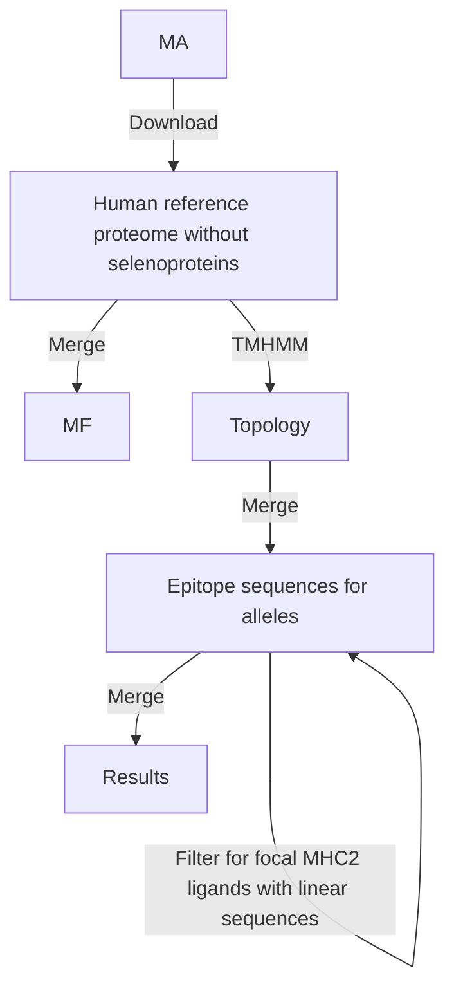

# Methods

```mermaid
graph TD;
    MA-->|Download| MB[Human reference proteome without selenoproteins];
    MB-->|Merge| MF;
    MB-->|TMHMM| MC[Topology];
    MC-->|Merge| MD[All IEDB MHC ligands];
    MD-->|Filter for focal MHC2 ligands with linear sequences| MD[Epitope sequences for alleles];
    MD-->|Merge| ME[Results];
```

